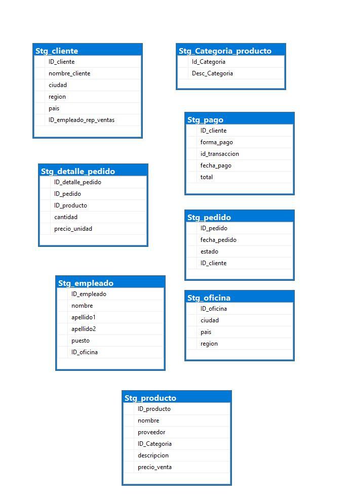

# PROCESO DE TRANSFORMACIÓN DE DATOS Y CARGA EN UN DATA MART 
# Proyecto de Jardinería

Este repositorio implementa un flujo completo de integración de datos desde la base OLTP hasta la capa Staging y, finalmente, el modelo estrella jardineria_dw, garantizando la trazabilidad e integridad de la información. Se documentan el diseño del modelo, las transformaciones aplicadas y los procesos de validación que habilitan el análisis de ventas. Además, incluye pruebas de calidad enfocadas al DW (completitud, integridad referencial, nulos/rangos, coherencia temporal y unicidad) y los scripts de creación y carga para la BD operacional y Staging, lo que permite reproducir el proceso end-to-end y verificar la calidad final de los datos.

## Calidad enfocada al DW
Las pruebas en `sql/quality_tests/` están orientadas a `jardineria_dw`.

## Estructura del proyecto
```
proyecto_datos/
├─ sql/
│  ├─ schema/
│  │  ├─ 01_DB_Jardineria.sql
│  │  ├─ 02_DB_Staging_Jardineria.sql
│  │  ├─ 03_DB_ModeloEstrella.sql
│  ├─ dml/
│  │  ├─ Datos_DB_Jardineria.sql
│  │  ├─ Datos_DB_Staging_Jardineria.sql
│  │  ├─ Datos_DB_ModeloEstrella.sql
│  ├─ quality_tests/
│  │  ├─ 01_dim_completitud.sql
│  │  ├─ 02_integridad_referencial_dw.sql
│  │  ├─ 03_valores_nulos_rangos.sql
│  │  ├─ 04_tiempo_coherencia.sql
│  │  └─ 05_unicidad_dimensiones.sql
│  ├─ diagramas/
│  │  ├─Esquema_relacional_BD_Jardinería
│  │  ├─Modelo_Estrella_Jardinería_DW
│  │  └─modelo_staging_jardineria
├─ reports/
│  └─ calidad_datos_2025.md
├─ Informes/
├─ README.md
└─ .gitignore 
```
## Diagramas

- Esquema relacional de la base de datos de Jardinería


- Modelo Staging de Jardinería



- Modelo Estrella de Jardinería_DW


## Informes

- [Proceso de creación Staging a partir de la base de datos de Jardinería](Informes/EA2_Alvarez_BD2_Stanging_Jardineria.pdf)
- [Proceso de Extracción Transformación y Carga de datos (ETL)](Informes/EA3_Alvarez_ProcesoETL[1].pdf)