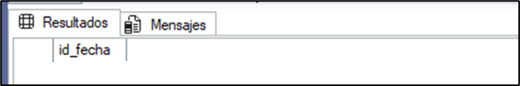

# Reporte de Calidad de Datos — DW

| Fecha | Prueba | Resultado | Observaciones |
|------:|--------|-----------|---------------|
| 07/10/2025      | 01_dim_completitud |OK | 6 Tablas con registros|
| 07/10/2025      | 02_integridad_referencial_dw |OK | Cero datos nulos|
| 07/10/2025      | 03_valores_nulos_rangos |OK |Precios totales validos |
| 07/10/2025      | 04_tiempo_coherencia |OK |Hay coherencia en las fechas de la dimensión tiempo |
| 07/10/2025      | 05_unicidad_dimensiones | OK |No hay duplicidad en los ID o claves |

## 1-	Conteo y completitud de dimensiones
Se realiza una consulta en la que se busca identificar que no haya dimensiones vacías. 

En total son seis tablas donde se presenta el total de filas de cada una.

## 2-	Integridad referencial entre hechos y dimensiones.

Consiste en identificar que la tabla de hechos contenga una clave o valor de id valido relacionado en cada dimensión.

Los resultados de la consulta indican que no presentan datos nulos en relación a las tablas de hechos y de dimensión.

## 3-	Validación de rangos y valores nulos.

La consulta imprime aquellos valores con atributos críticos nulos, precios de venta que estén por debajo de 0 o en negativo y verifica que los valores de venta total sean superiores o diferentes al producto de la cantidad por precio unitario de venta.

Los resultados arrojan que no hay registros relacionados a la consulta y todo se encuentra ok.

## 4-	Coherencia temporal de las fechas 

Esto valida que todas las fechas en la tabla de hechos si se encuentren dentro de la dimensión tiempo.

Los resultados confirman que hay coherencia con las fechas.

## 5-	Duplicidad en claves de dimensión

Esta consulta permite asegurar que los id o claves de las dimensiones no estén duplicados. 

Los resultados indican que no hay duplicidad en las claves o id de cada tabla de las dimensiones. 

